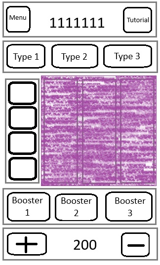
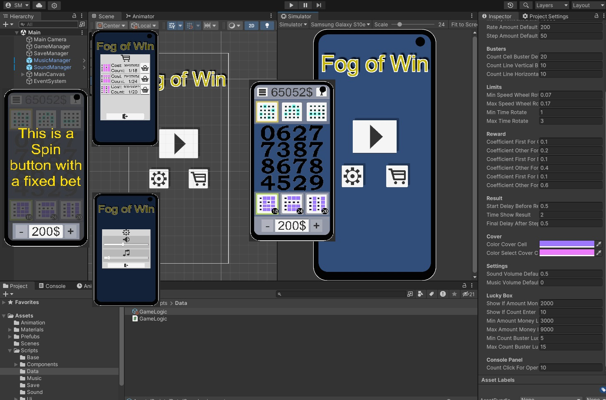

# Slot
Fog of Win

## Task:
The game is based on a 4v4 slot. 

A slot in which the wheels scroll when pressed. And when it stops, all wheels, except the first one, are covered with a sprite (hereafter Fog). And we need to choose which method we will use to calculate the result from the three available (more on Calculation Methods below). Before calculating the result with the chosen type, we can apply boosters to open the closed part of the slot from the three available (more about Fog Boosters below).

Calculation methods:
- all matches of the slot icons with the icon on the first wheel are counted;
- slot matches are counted according to the icon on the first wheel, but if they form a continuous curve where each icon is tangent to each other vertically, horizontally or diagonally;
- slot matches are counted according to the icon on the first wheel, but when they are tangent to each other horizontally;

Types of Fog Boosters are ways to open fog:
- opening one icon;
- opening a vertical line of icons;
- opening a horizontal line of icons;

Main requirements:
- two scenes
 - the first - the main menu with settings (sounds, music), a Mini-Roulette (more details), a shop for buying boosters, a button to Start the game;
 - the second - the game itself, learning the basics of the game, the button to return to the menu, the game buttons according to the diagram (the diagram of the Game Interface in the first picture);
- write the logic of the rewards so that it is interesting to play with a more complex type of calculation;
- if the player has less than the indicated amount, then give access to Mini Roulette;
- provide access to Mini Roulette after the player enters the game more than the specified number of times;
- when opening the game scene, show the progress panel, where the load is displayed;
- Mini Roulette is a pop-up window or a separate window where a small game is implemented, where the player is given the opportunity to win: money, boosters to open the fog and other possible things that will be implemented in the game;
- on the scene with the game, add a pop-up window that will show the player's winnings;
- add sounds;
- export game settings to Scriptable Object for convenient game settings (as many parameters as possible);

## Implemented:
All

## Unity 2022.3.26

